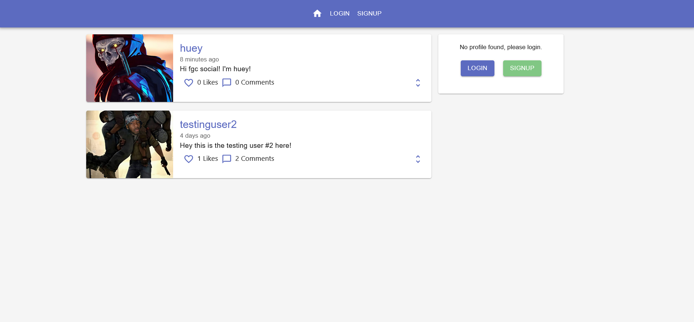

# FGC Social
a social media to unite the fgc.

### Live @ [https://fgc-social.web.app/](https://fgc-social.web.app/)

Built with React.js, Firebase, and MaterialUI(Mui).

## Introduction

*This application allows users to create and comment on posts, showing the most recent posts/comments at the top of the feed, as well as notifying a user when someone else has liked or commented on their post. Firebase is used with firebase functions to provide data storage and authentication, as well as uploading profile images and changing user info.*

## Running FGC Social Locally

First install dependencies in the /client directories with:

### `npm install`

To launch the client you can run:

### `npm start`

This script runs the app in the development mode. 

Open [http://localhost:3000](http://localhost:3000) to view it in the browser.

The page will reload if you make edits. 
